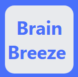

    
 

# Brain Breeze 

Table of Contents

<ol>
  <li>
    <a href="#about-the-project">About the Project</a>
    <ul>
        <li><a href="#built-with">Built With</a></li>
    </ul>
  </li>
  <li>
    <a href="#usage">Usage</a>
  </li>
  <li>
    <a href="#roadmap">Roadmap</a>
  </li>
  <li>
    <a href="#the-team">The Team</a>
  </li>
  <li>
    <a href="#acknowledgments">Acknowledgments</a>
  </li>
</ol>

 

## About the Project

Inspired by the language-learning app, Duolingo, Brain Breeze is a learning app available in multiple platforms from iOS and Android devices to web browsers in any OS where students will be able to learn bite-size lessons rather than the tradiitonal three hours a week of lecture in universities. For instructors, they will be able to create and publish classes, organize the class with modules, and create lessons with content with text, video links, or both. Instructors can also implement assessments/quizzes into the lesson aswell to test the student's knowledge on the content.

### Built With

The app is built with:

<ul>
  <li><b>Programming Language:</b>JavaScript</li>
  <li><b>Framework:</b> React Native</li>
  <li>Node/Express JS</li>
  <li>MySQL</li>
  <li>Tools: Visual Studio Code, Expo, Android Studio, XCode, Jira</li>
</ul>

## Usage

## Roadmap
<ul>
  <li>Sprint 1</li>
    <ul>Status: Completed October 27th, 2021</ul>
    <ul>Prepared documentation and signed all necessary documentation with the client.</ul>
  <li>Sprint 2</li>
    <ul>Status: Completed November 1st, 2021</ul>
    <ul>Prepared context and event table diagrams to be presented to the client.</ul>
  <li>Sprint 3</li>
    <ul>Status: Completed December 2nd, 2021</ul>
    <ul>Listed possible technologies we could use to create the app and prepared a tech demo to demonstrate.</ul>
  <li>Sprint 4</li>
    <ul>Status: Completed December 12th, 2021</ul>
    <ul>Develop a prototype to showcase to the client and began the framework for the backend.</ul>
  <li>Sprint 5</li>
    <ul>Status: Completed February 14th, 2022</ul>
    <ul>Developed a functional UI.</ul>
  <li>Sprint 6</li>
    <ul>Status: Completed February 28th, 2022 </ul>
    <ul>Continued developing a functional UI and database.</ul>
  <li>Sprint 7</li>
    <ul>Status: Completed March 14th, 2022 </ul>
    <ul>Finished setting up the database; continued creating the UI in the app.</ul>
  <li>Sprint 8</li>
    <ul>Status: Completed April 11th, 2022 </ul>
    <ul>App is 60% finished; aim to complete a MVP (miniumum viable Product) version of the app to be shown to the client at the end of the month.</ul>
  <li>Sprint 9</li>
    <ul>Status: Completed april 25th, 2022</ul>
    <ul>Minimum Viable Product (MVP) has been completed. Showcased to client and will fix and polish the app from here on.</ul>
  <li>Sprint 10</li>
    <ul>Status: In Progress</ul>
    <ul>App is being polished and optimized. Will get some visual updates and will start testing the app and write up the necessary manuals for the client.</ul>
</ul>

## Contributing

## The Team
<ul>
  <li>Jerald Velicaria</li>
  <li>Joshua Bartley</li>
  <li>Foad Olfat</li>
  <li>Alexander Meinberg</li>
  <li>Phuc Truong</li>
  <li>Victor Peraza</li>
  <li>Emmanuel Silva</li>
</ul>

## Acknowledgments 
