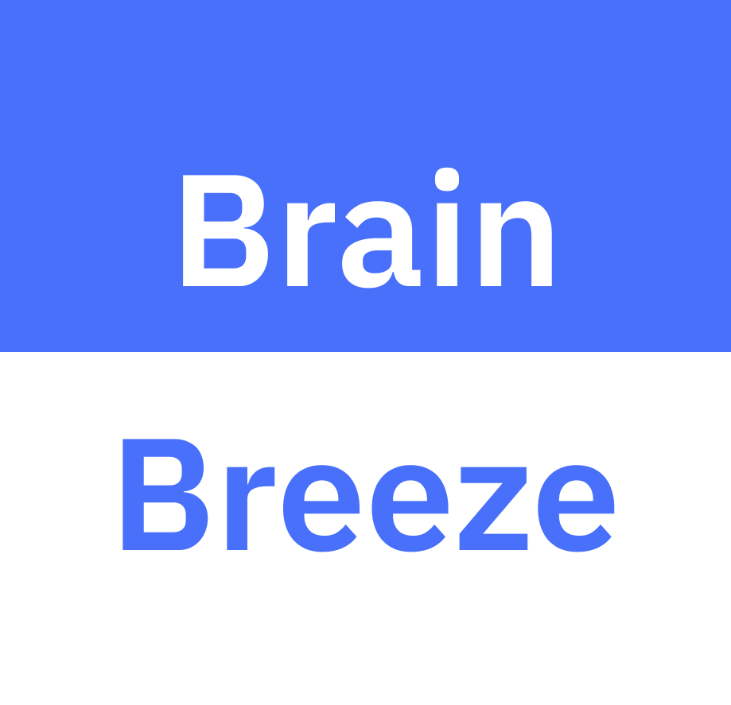

<div align="center">
    <a href="https://clever-torte-9d82b6.netlify.app/"></a>
 </div>

# Brain Breeze 

**Table of Contents**
<ol>
  <li>
    <a href="#about-the-project">About the Project</a>
    <ul>
        <li><a href="#built-with">Built With</a></li>
    </ul>
  </li>
  <li>
    <a href="#installation">Installation</a>
  </li>
  <li>
    <a href="#roadmap">Roadmap</a>
  </li>
  <li>
    <a href="#the-team">The Team</a>
  </li>
  <li>
    <a href="#acknowledgments">Acknowledgments</a>
  </li>
</ol>

<br />

## About the Project

<p>Inspired by the language-learning app, Duolingo, Brain Breeze is a learning app available in multiple platforms from iOS and Android devices to web browsers in any OS where students will be able to learn bite-size lessons rather than the tradiitonal three hours a week of lecture in universities. For instructors, they will be able to create and publish classes, organize the class with modules, and create lessons with content with text, video links, or both. Instructors can also implement assessments/quizzes into the lesson aswell to test the student's knowledge on the content.</p>

### Built With
The following is the list of technologies, languages, and tools the developer team, NerdJS, has used to develop the application:
- **Technologies, libraries and framework:** React Native, Express/Node JS
- **Web Services:** Swagger
- **Web Technologies:** React Native
- **IDE:** Visual Studio Code, Android Studio, XCode
- **Networking protocols and data security:** AWS security protocols, tokens
- **Databases/Data storages:** RDS, MySQL Workbench
- **Applications:** AWS, EC2 (front end app and web deployment), Putty, WinSCP, OpenVPN

## Installation

To test out this project, make sure you have [Node.js](https://nodejs.org/en/) installed. 


1. Open up your (git bash) terminal and git clone the Front-End repository AND Back-End Repository to a folder. The Back-End Repo can be found [here](https://github.com/NerdJS-Project/Back-End).
```
    git clone https://github.com/NerdJS-Project/Front-End.git
    
    git clone https://github.com/NerdJS-Project/Back-End.git
```
2. You will then need to npm install both directories and download all packages from the json file. 
```
cd Front-End 
npm install
```
and then do the same for the 'Back-End' directory.
```
cd Back-End/nerd-backend 
npm install
```
3. You will need to two terminals running at the same to run both the Front-End and the Back-End\*. If you are using Visual Studio Code, Click on the 'Split Terminal' button on the top-right of the terminal next to the trash icon (kill terminal) or Ctrl + Shift + 5. 

4. Change directories of one of the terminals to the Front-End directory and the other terminal to the Back-End directory.

5. Then in each terminal run `npm start`. 

6. For the Front-End, after running `npm start`, expo would ask how you would like to open the application whether it's the web version via browser or a mobile phone.
   - If you want to run it on an Android, you will need to install Android Studio and have either a virtual device running or your own Android device via USB debugging. 
   - For iOS, you will need xCode installed, and have it running in the background to have it open as well. 

\* You may not need to change the API_URL in the APIConnection.js file to switch the URL to a local host address since it may have its own server link running. 

## Roadmap
<ul>
  <li>Sprint 1</li>
    <ul>Status: Completed October 27th, 2021</ul>
    <ul>Prepared documentation and signed all necessary documentation with the client.</ul>
  <li>Sprint 2</li>
    <ul>Status: Completed November 1st, 2021</ul>
    <ul>Prepared context and event table diagrams to be presented to the client.</ul>
  <li>Sprint 3</li>
    <ul>Status: Completed December 2nd, 2021</ul>
    <ul>Listed possible technologies we could use to create the app and prepared a tech demo to demonstrate.</ul>
  <li>Sprint 4</li>
    <ul>Status: Completed December 12th, 2021</ul>
    <ul>Develop a prototype to showcase to the client and began the framework for the backend.</ul>
  <li>Sprint 5</li>
    <ul>Status: Completed February 14th, 2022</ul>
    <ul>Developed a functional UI.</ul>
  <li>Sprint 6</li>
    <ul>Status: Completed February 28th, 2022 </ul>
    <ul>Continued developing a functional UI and database.</ul>
  <li>Sprint 7</li>
    <ul>Status: Completed March 14th, 2022 </ul>
    <ul>Finished setting up the database; continued creating the UI in the app.</ul>
  <li>Sprint 8</li>
    <ul>Status: Completed April 11th, 2022 </ul>
    <ul>App is 60% finished; aim to complete a MVP (miniumum viable Product) version of the app to be shown to the client at the end of the month.</ul>
  <li>Sprint 9</li>
    <ul>Status: Completed april 25th, 2022</ul>
    <ul>Minimum Viable Product (MVP) has been completed. Showcased to client and will fix and polish the app from here on.</ul>
  <li>Sprint 10</li>
    <ul>Status: In Progress</ul>
    <ul>App is being polished and optimized. Will get some visual updates and will start testing the app and write up the necessary manuals for the client.</ul>
</ul>


## The Team
<ul>
  <li>Jerald Velicaria</li>
  <li>Joshua Bartley</li>
  <li>Foad Olfat</li>
  <li>Alexander Meinberg</li>
  <li>Phuc Truong</li>
  <li>Victor Peraza</li>
  <li>Emmanuel Silva</li>
</ul>

Lab Advisors:
- Dr. Ahmed Salem (Fall 2021)
- Dr. Jinsong Ouyang (Spring 2022)

Senior Project Professors:
- Chris Grove (CSC 190 for Fall 2021)
- Kenneth Elliott (CSC 191 for Spring 2022)

## Acknowledgments 
Resources and Documentation we have used: 
- [React Native Paper](https://callstack.github.io/react-native-paper/) 
- [React Native Elements](https://reactnativeelements.com/docs)
- [React Native](https://reactnative.dev/docs/getting-started)
- [Maximilian Schwarzmüller's "React Native - The Practical Guide" Udemy Course](https://www.udemy.com/course/react-native-the-practical-guide/)
- [Icons by Material Design](https://materialdesignicons.com/)
    - [Github Repository for MaterialCommunityIcons](https://github.com/Templarian/MaterialDesign)

